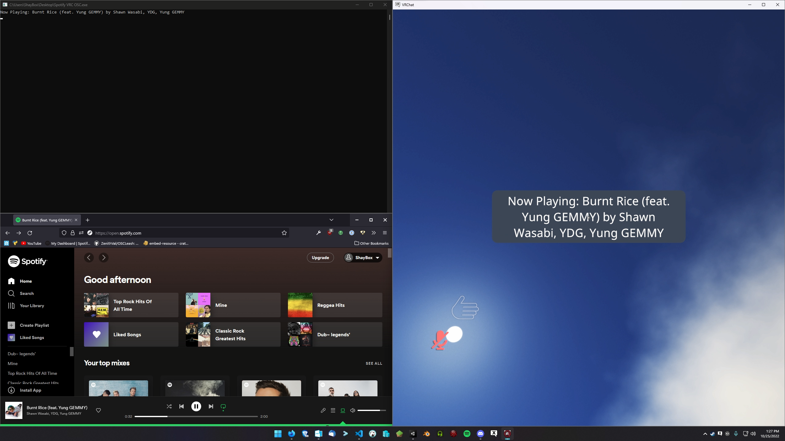

# Spotify Plugin

Sends the currently playing Spotify track to Chatbox

#### Screenshot

### How to Setup:
1. Navigate to [Spotify for Developers Dashboard](https://developer.spotify.com/dashboard)
2. Sign in or Create an account  

3. Create an App  
  

4. Click `EDIT SETTINGS`  
  
5. Add a Redirect URI (Default: `http://127.0.0.1:2345`)  

6. Click `USERS AND ACCESS`  

7. Click `ADD NEW USER`  

8. Enter your Spotify information  

9. Click `SHOW CLIENT SECRET`  

10. Copy your `Client ID` and `Client Secret` into `spotify.toml`  
  
